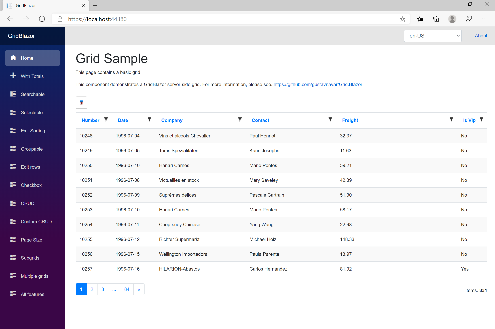

# GridJavaCore

GridJavaCore is a back-end library for Java JPA / Hibernate projects that performs paging, sorting, filtering and others, to support client Blazor projects to show data in a grid. It will also support clients based on Vue.js projects with a Grid library (no yet developed).

## Documentation
* [Documentation for Blazor WASM with GridJavaCore back-end (REST API)](./docs/java_backend/Documentation.md)

This is an example of a table of items using this component:



## Change Log
https://github.com/gustavnavar/Grid.Java.Core/releases

## Folder description
* [gridjavacore](./gridjavacore): Library to build back-ends based on Java JPA / Hibernate
* [demo](./demo): Spring Boot demo project supporting the gridjavacore library. It can be tested with this [Blazor WASM project](https://github.com/gustavnavar/Grid.Blazor/tree/master/GridBlazorJava)
* [docs](./docs): Documentation

The SQL Server database for all demos can be downloaded from [here](https://github.com/gustavnavar/Grid.Java.Core/tree/master/sample_database)

Alternatively, if you prefer to install a fresh version of the database you can perform the following steps:
- run this script from Microsoft web to create a new database: https://github.com/microsoft/sql-server-samples/blob/master/samples/databases/northwind-pubs/instnwnd.sql
- add a column to the Customers table with the name IsVip of type bit (NOT NULL) and default value 0:
    ```sql
        USE Northwind;
        ALTER TABLE dbo.Customers ADD IsVip bit NOT NULL DEFAULT 0 WITH VALUES;
        GO
    ```
- change manually some values of the new IsVip column to True
- review the datetime columns. Any mismatch between JPA model and database definitions will produce an exception and filtering will not work as expected.


