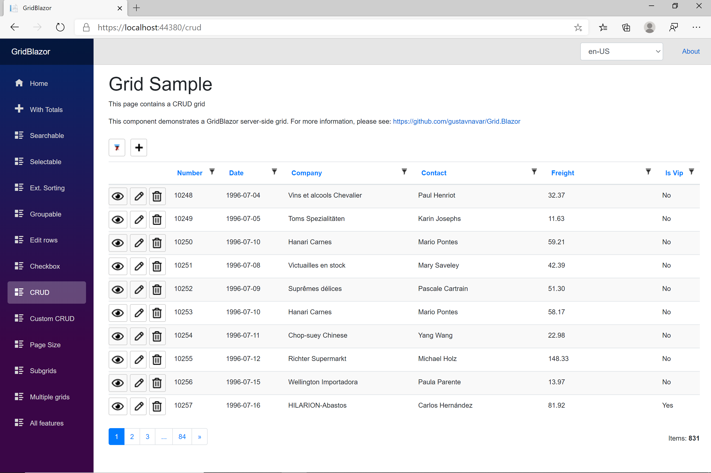
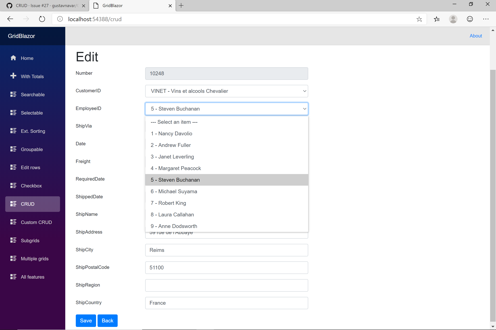

# CRUD

[Index](Documentation.md)

GridJavaCore supports CRUD forms to add, edit, view and delete items for Blazor client-side projects.

These are the supported features:
- Full screen forms
- Auto-generated forms with field type detection based on column definition
- Lists for drop-drown fields
- Custom forms
- Support of grid models including 1:N relationships
- Support of entities with multiple foreign keys
- Direct URLs

## Auto-generated forms

You will need a controller supporting 4 web services to perform the CRUD operation on the back-end. This is an example of this type of controller:
  
```java
@RestController
@RequiredArgsConstructor
@RequestMapping(value = "/api")
public class OrderController {

    private final OrderRepository orderRepository;
    private final CustomerRepository customerRepository;
    private final EmployeeRepository employeeRepository;
    private final ShipperRepository shipperRepository;

    @GetMapping(value = {"/order", "/Order"})
    public ResponseEntity<List<Order>> getAll() {
        return ResponseEntity.ok(orderRepository.findAll());
    }

    @PostMapping(value = {"/order", "/Order"})
    public ResponseEntity<Object> create(@RequestBody Order order) {

        try {
            if(order.getCustomerID() != null && ! order.getCustomerID().isBlank()) {
                var customer = customerRepository.findById(order.getCustomerID());
                customer.ifPresent(order::setCustomer);
            }
            if(order.getEmployeeID() != null) {
                var employee = employeeRepository.findById(order.getEmployeeID());
                employee.ifPresent(order::setEmployee);
            }
            if(order.getShipVia() != null) {
                var shipper = shipperRepository.findById(order.getShipVia());
                shipper.ifPresent(order::setShipper);
            }
            Order savedOrder = orderRepository.saveAndFlush(order);
            return ResponseEntity.ok(savedOrder.getOrderID());
        }
        catch (Exception e) {
            return ResponseEntity.badRequest()
                    .body(e.getMessage().replace('{', '(').replace('}', ')'));
        }
    }

    @GetMapping(value = {"/order/{id}", "/Order/{id}"})
    public ResponseEntity<Order> get(@PathVariable int id) {

        Optional<Order> order = orderRepository.findById(id);
        return order.map(ResponseEntity::ok).orElseGet(() -> ResponseEntity.notFound().build());
    }

    @PutMapping(value = {"/order/{id}", "/Order/{id}"})
    public ResponseEntity<Object> update(@RequestBody Order order, @PathVariable int id) {

        Optional<Order> attachedOrder = orderRepository.findById(id);
        if (attachedOrder.isEmpty())
            return ResponseEntity.notFound().build();

        try {
            order.setOrderID(id);
            if(order.getCustomerID() != null && ! order.getCustomerID().isBlank()
                    && !order.getCustomerID().equals(attachedOrder.get().getCustomerID())) {
                var customer = customerRepository.findById(order.getCustomerID());
                customer.ifPresent(order::setCustomer);
            }
            if(order.getEmployeeID() != null && !order.getEmployeeID().equals(attachedOrder.get().getEmployeeID())) {
                var employee = employeeRepository.findById(order.getEmployeeID());
                employee.ifPresent(order::setEmployee);
            }
            if(order.getShipVia() != null && !order.getShipVia().equals(attachedOrder.get().getShipVia())) {
                var shipper = shipperRepository.findById(order.getShipVia());
                shipper.ifPresent(order::setShipper);
            }
            orderRepository.saveAndFlush(order);
            return ResponseEntity.noContent().build();
        }
        catch (Exception e) {
            return ResponseEntity.badRequest()
                    .body(e.getMessage().replace('{', '(').replace('}', ')'));
        }
    }

    @DeleteMapping(value = {"/order/{id}", "/Order/{id}"})
    public ResponseEntity<Object> delete(@PathVariable int id) {

        Optional<Order> order = orderRepository.findById(id);
        if (order.isEmpty())
            return ResponseEntity.notFound().build();

        try {
            orderRepository.delete(order.get());
            orderRepository.flush();
            return ResponseEntity.noContent().build();
        }
        catch (Exception e) {
            return ResponseEntity.badRequest()
                    .body(e.getMessage().replace('{', '(').replace('}', ')'));
        }
    }
}
```

## Column definition

The column definition must include the primary keys:
- using the **setPrimaryKey(true)** method for columns with auto-generated keys, or
- using the **setPrimaryKey(true, false)** method for columns with manually generated keys

This is an example of column definition:

```java
Consumer<IGridColumnCollection<Order>> columns = c -> {
    c.add("orderID", Integer.class).setPrimaryKey(true);
    c.add("customerID", String.class);
    c.add("employeeID", Integer.class);
    c.add("shipVia", Integer.class, true);
    c.add("orderDate", LocalDateTime.class, "orderCustomDate");
    c.add("customer.companyName", String.class);
    c.add("customer.contactName", String.class);
    c.add("freight", BigDecimal.class);
    c.add("customer.isVip",Boolean.class);
    c.add("requiredDate",  LocalDateTime.class, true);
    c.add("shippedDate",  LocalDateTime.class, true);
    c.add("shipName",  String.class, true);
    c.add("shipAddress",  String.class, true);
    c.add("shipCity",  String.class, true);
    c.add("shipPostalCode",  String.class, true);
    c.add("shipRegion",  String.class, true);
    c.add("shipCountry",  String.class, true);
};
```

This is an example of a grid using CRUD:



And this is an auto-genereated edit form:



[<- Front-end back-end API](API.md)