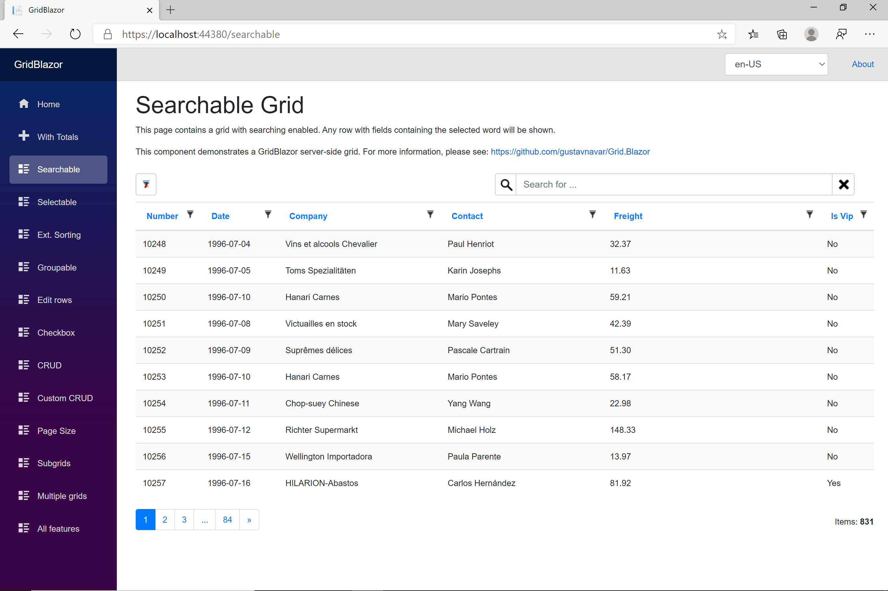

# Searching

[Index](Documentation.md)

You can enable the searching option for your grid. Searching allows to search for a text on all columns at the same time.



You can enable searching for all columns of a grid using the **searchable** method for the **GridServer** object:
```java
    IGridServer<Order> server = new GridServer<>(em, Order.class, request.getParameterMap(), columns, 10)
        .searchable(true, false, false);
```

## Searching parameters

Parameter | Description | Example
--------- | ----------- | -------
enable (optional) | bool to enable searching on the grid | searchable(true, ...)
onlyTextColumns (optional) | bool to enable searching on all collumns or just on string ones | searchable(..., true, ...)
hiddenColumns (optional) | bool to enable searching on hidden columns | searchable(..., true)
searchOptions (optional) | ```Consumer<SearchOptions>``` to configure all search options

```enable``` default value is ```true```, ```onlyTextColumns``` default value is ```true```, and ```hiddenColumns``` default value is ```false```.

## SearchOptions attributes

Parameter | Description
--------- | -----------
enabled (optional) | bool to enable searching on the grid
onlyTextColumns (optional) | bool to enable searching on all collumns or just on string ones
hiddenColumns (optional) | bool to enable searching on hidden columns
splittedWords (optional) | bool to enable search of any word contained in the search phrase on any column. The defaul behavior is to search the complete search phrase on any column.

```enabled``` default value is ```true```, ```onlyTextColumns``` default value is ```true```, ```hiddenColumns``` default value is ```false```, and ```splittedWords ``` default value is false.


Searching on boolean columns has been disabled because EF Core 3.0 is not supporting it yet.

# Disable diacritics distinction

GridJavaCore distinguishes among letters with diacritics by default. If you search the term "bru", it will return all records that contains "bru", but it won't return any record containing "brú", "brû" or "brü". 

Anyway, it is possible to override the default behavior, so GridJavaCore will return any record containing "brú", "brû" or "brü". 

The solution to be implemented will depend on the back-end used to return the grid data. I will describe how to implement it for grids using JPA. It will be necessary to create a stored function on the database that will call it and configure the ```GridServer``` object:
1. For SQL Server you should open the ```SQL Server Studio Management``` tool and execute the following SQL query on your database to create the ```RemoveDiacritics``` function:

    ```sql
    CREATE FUNCTION [dbo].[RemoveDiacritics] (
        @input varchar(max)
    ) RETURNS varchar(max)

    AS BEGIN
        DECLARE @result VARCHAR(max);

        select @result = @input collate SQL_Latin1_General_CP1253_CI_AI

        return @result
    END
    ```

2. and finally you must call the ```setRemoveDiacritics``` method of the ```GridServer``` class:
    ```java
    IGridServer<Order> server = new GridServer<>(em, Order.class, request.getParameterMap(), columns, 10)
        .searchable(true)
        .setRemoveDiacritics("dbo.RemoveDiacritics");
    ```

[<- Sorting](Sorting.md) | [Filtering ->](Filtering.md)