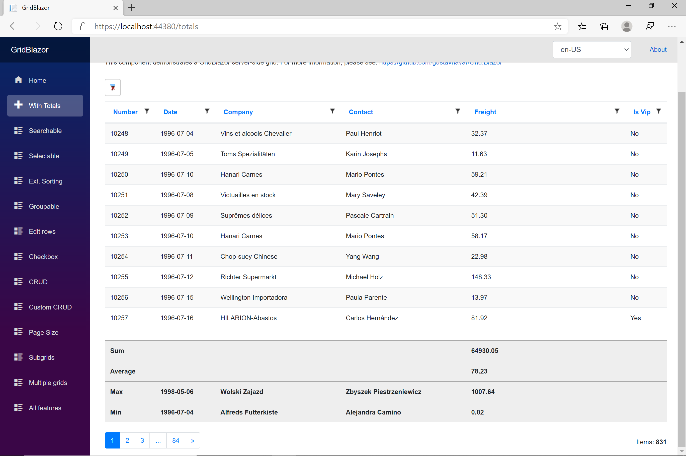

# Totals

[Index](Documentation.md)

You can enable the totals option for each column of your grid.



You can enable total's calculation for each column of a grid using the **sum**, **average**, **max** and/or **min** methods for the **column** object:

```java
    columns.add("freight", BigDecimal.class).sum(true).average(true).max(true).min(true);
```

* **sum** method works only for number columns
* **average** method works only for number columns
* **max** method works for number, date-time and text columns
* **min** method works for number, date-time and text columns

## Methods

Method | Parameter | Description | Example
------ | --------- | ----------- | -------
sum | enable | bool to enable sum calculation on column | sum(true)
average | enable | bool to enable average calculation on column | average(true)
max | enable | bool to enable maximum calculation on column | max(true)
min | enable | bool to enable minimum calculation on column | min(true)


## Calculated totals

It is possible to configure calculated totals based on other totals. They can be added to existing columns or to new ones. In both cases, columns must be named.

You can enable calculated totals for each column of a grid using the **calculate** method for the **column** object:

```java
    columns.add("freight", BigDecimal.class).sum(true).average(true).max(true).min(true)
        .calculate("Average 2", x -> x.getGrid().getItemsCount() == 0 
            ||  x.get("freight") == null || x.get("freight").getSumValue().getNumber().isEmpty()
            ? "" : x.get("freight").getSumValue().getNumber().get()
            .divide(BigDecimal.valueOf(x.getGrid().getItemsCount()), MathContext.DECIMAL32));
```

The parameters of the **calculate** method are:

Parameter | Type                                                              | Description
--------- |-------------------------------------------------------------------| -----------
name | String                                                            | label of the total
calculation | Function<IGridColumnCollection<T>, Object>                        | function to calculate the total
 
The function to calculte the total has only one parameter, the grid column collection. 

This parameter includes a reference to the Grid, so you can use any Grid property as the number of records.

You can also get any column using the **get** method. So you can include any column total using the following methods of the columns:
- getSumValue()
- getAverageValue()
- getMaxValue()
- getMinValue()

These properties contain the total values in one of the following attributes, depending on the type of column:
- Number
- Date / Time
- String 

You can also use any other variable of the page in calculation function.

[<- Custom columns](Custom_columns.md) | [Sorting ->](Sorting.md)